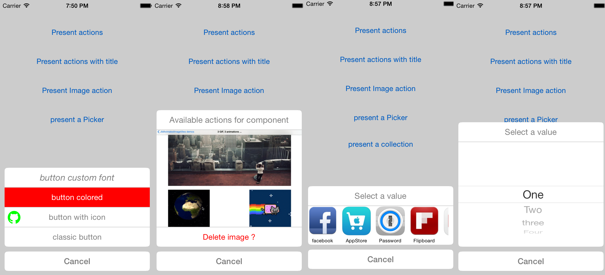
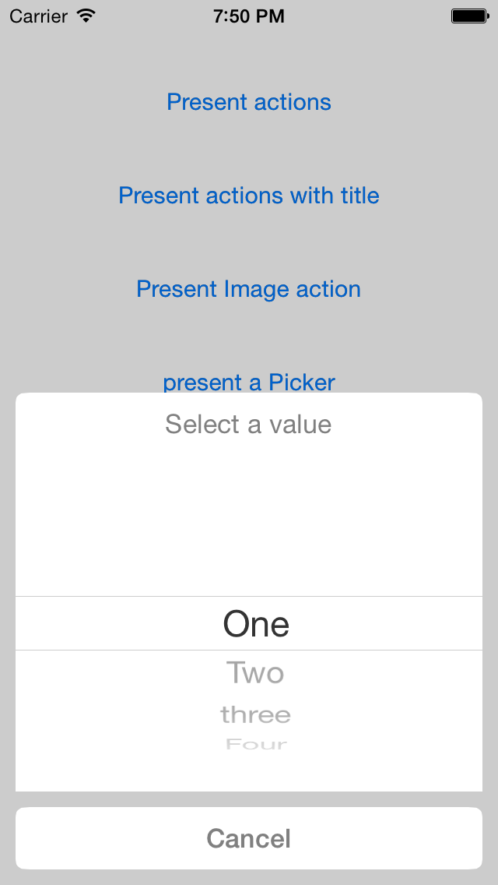

## My other works

[http://leverdeterre.github.io] (http://leverdeterre.github.io)

# JMActionSheetDescription
ActionSheet and UIActivityViewController replacement, using a descriptor component. 

[](http://twitter.com/leverdeterre)
[](https://github.com/leverdeterre/PermissiveResearch/blob/master/LICENCE)
[](https://github.com/leverdeterre/PermissiveResearch)
[](http://cocoapods.org/pods/JMActionSheetDescription)

## Capability
* present labels
* present actions (UIButton)
* present image(s)
* present picker
* present datepicker
* present icons collections

## Changelog

0.4.9 :

* add DatePicker support

0.4.7 / 0.4.8 :

* Improve protocol usage
* Increase Swift compatibility
* Fix autolayout (in demo)

0.4.6 :

* FIX autorotate,
* FIX iOS7 crash,
* Starting autolayout implementation and rotation support

0.4.5 :

 * Add support for iOS9,
 * Add support of UITraitCollection,
 * Add support of UIPopoverPresentationController.

0.4.2 :

  * Add multiple pictures selecion support.

0.4.0 :

  * Add UICollectionView support.


## Screenshots







## Installation & Usage

JMActionSheetDescription is available through [CocoaPods](http://cocoapods.org). To install
it, simply add the following line to your Podfile:

```ruby
pod "JMActionSheetDescription"
```

### Manual creation 

```objective-c
//init your description
JMActionSheetDescription *desc = [[JMActionSheetDescription alloc] init];

//Configure your colors
desc.actionSheetTintColor = [UIColor grayColor];
desc.actionSheetCancelButtonFont = [UIFont boldSystemFontOfSize:17.0f];
desc.actionSheetOtherButtonFont = [UIFont systemFontOfSize:16.0f];

//Cancel item
JMActionSheetItem *cancelItem = [[JMActionSheetItem alloc] init];
cancelItem.title = @"Cancel";
desc.cancelItem = cancelItem;

//Can configure a context for your action .. an url ? image ? (work in progress)
JMActionContextItem *contextItem = [[JMActionContextItem alloc] init];
contextItem.image = [UIImage imageNamed:@"gif_experiments"];
contextItem.imageHeight = 200.0f;
desc.contextItem = contextItem;
desc.title = @"Available actions for component";

//item + block
JMActionSheetItem *itemShare = [[JMActionSheetItem alloc] init];
itemShare.title = @"last action";
itemShare.action = ^(void){
    NSLog(@"last action pressed");
};

//Pickeritem + block
JMActionSheetPickerItem *pickerItem = [[JMActionSheetPickerItem alloc] init];
    pickerItem.elements = @[@"One", @"Two", @"three", @"Four"];
    pickerItem.pickerAction = ^(NSString *selectedValue){
        NSLog(@"selectedValue %@",selectedValue);
    };

desc.items = @[itemShare,pickerItem];
[JMActionSheet showActionSheetDescription:desc inViewController:self];
```


### Shortcuts for creation 

#### To present a picker (JMDatePickerActionSheet) 

```objective-c
NSDate *minDate = [NSDate date];
NSDate *maxDate = [[NSDate date] dateByAddingTimeInterval:999999];
NSDate *selectedDate = [[NSDate date] dateByAddingTimeInterval:64000];

[JMDatePickerActionSheet showDatePickerActionSheetMinDate:minDate maxDate:maxDate selectedDate:selectedDate didSelectBlock:^(id selectedItem) {
      NSLog(@"Plop");
} 
title:@"MyTitle" 
inViewController:self];
```

#### To present a picker (JMPickerActionSheet) 

```objective-c
[JMPickerActionSheet showPickerActionSheetElements:@[@"One", @"Two", @"three", @"Four"]
                                    didSelectBlock:^(NSString *selectedValue){
                                                    NSLog(@"selectedValue %@",selectedValue);}
                                            title:@"JMPickerActionSheet methods"
                                inViewController:self];
```

#### Present a mutliple images choice (JMImagesActionSheet)

```objective-c
[JMImagesActionSheet showImagesActionSheetImages:@[
                        [UIImage imageNamed:@"gif_experiments"],
                        [UIImage imageNamed:@"gif_experiments"],
                        [UIImage imageNamed:@"gif_experiments"]]
                                didSelectBlock:^(id selectedValue) {
                                                NSLog(@"didSelectBlock %@",selectedValue); }
                                        title:@"The title"
                            inViewController:self];
```


## License

JMActionSheetDescription is available under the MIT license. See the LICENSE file for more info.
